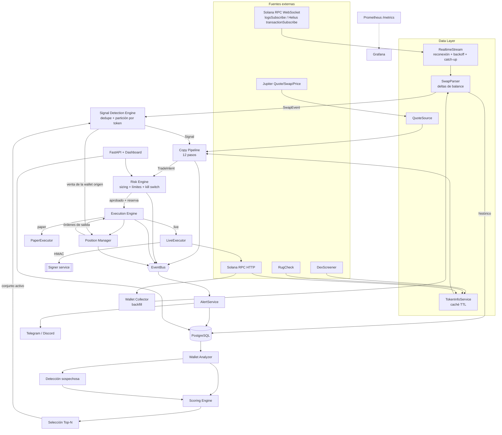

# Diseño técnico — Copy Trading Engine (uso personal)

> Documento de diseño previo al código (sección 27 del encargo). Todo lo que se
> describe aquí está implementado en `src/copytrader/` salvo lo marcado
> explícitamente como **[futuro]**.

## 0. Supuestos y alcance

| Decisión | Elección | Motivo |
|---|---|---|
| Blockchain principal | **Solana** (spot DEX: Jupiter, Raydium, Pump.fun/PumpSwap, Orca, Meteora) | Es el ecosistema donde el copy trading de wallets on-chain es más activo, las wallets son públicas, los bloques son de ~400 ms y existen streams en tiempo real maduros (WebSockets RPC, Helius, Yellowstone gRPC). |
| Portabilidad | Capa de datos y ejecución **agnóstica de cadena** mediante interfaces (`providers/interfaces.py`, `execution/interfaces.py`) | Añadir EVM (Base/Ethereum) implica escribir adaptadores, no tocar scoring/riesgo/posiciones. |
| Tipo de despliegue | **Monolito modular asíncrono** + **servicio firmador separado** | Una sola persona, ~100 wallets: un proceso asyncio es más rápido (sin saltos de red internos) y con menos puntos de fallo que microservicios. La clave privada vive en otro proceso/contenedor. |
| Moneda de cuenta | USD (valoración) y SOL (ejecución) | Las métricas se comparan en USD; las compras se pagan en SOL (configurable). |
| Principio rector | **Preservar capital > número de operaciones** | Cualquier duda (dato viejo, proveedor caído, cálculo inconsistente) → *no operar* (fail-closed). Las salidas, en cambio, siempre se permiten. |

Nada en este sistema promete rentabilidad. Todas las métricas son estimaciones
estadísticas sobre el pasado y las decisiones se tratan como probabilísticas.

---

## 1. Arquitectura completa

La aplicación se organiza en capas con dependencias en un solo sentido
(las capas superiores dependen de interfaces de las inferiores, nunca al revés):

```
┌─────────────────────────────────────────────────────────────────────────────┐
│  Presentación:  API REST (FastAPI) + Dashboard web  ·  Notificaciones TG/DC │
├─────────────────────────────────────────────────────────────────────────────┤
│  Orquestación:  Application (ciclo de vida) · Scheduler · EventBus interno  │
├──────────────┬──────────────┬───────────────┬───────────────┬───────────────┤
│  Wallet      │  Wallet      │  Scoring +    │  Signal       │  Position     │
│  Collector   │  Analyzer    │  Detección +  │  Detection +  │  Manager      │
│              │              │  Selección    │  Copy Pipeline│  (salidas)    │
├──────────────┴──────────────┴───────────────┼───────────────┴───────────────┤
│                                             │  Risk Management Engine       │
│                                             │  (independiente, con estado)  │
│                                             ├───────────────────────────────┤
│                                             │  Execution Engine             │
│                                             │  Paper │ Live (Jupiter+Signer)│
├─────────────────────────────────────────────┴───────────────────────────────┤
│  Blockchain Data Layer: RPC · WebSocket streams · Jupiter · DexScreener ·   │
│  RugCheck · precio SOL · proveedor simulado     (retry, CB, rate limit)     │
├─────────────────────────────────────────────────────────────────────────────┤
│  Persistencia: PostgreSQL (SQLAlchemy async + Alembic)                      │
├─────────────────────────────────────────────────────────────────────────────┤
│  Transversal: Config central · Logging estructurado · Métricas Prometheus · │
│  Seguridad (redacción, keystore cifrado, HMAC, auth) · Clock inyectable     │
└─────────────────────────────────────────────────────────────────────────────┘
          ▲ HMAC + nonce (red interna)
          │
┌─────────┴─────────┐
│  Signer service   │  Proceso/contenedor aparte. Único lugar donde se descifra
│  (keystore + pol.)│  la clave. Aplica política propia (programas permitidos,
└───────────────────┘  topes de importe, rate limit) antes de firmar.
```

### Componentes y responsabilidades

| Componente | Módulo | Responsabilidad | Entrada → Salida |
|---|---|---|---|
| **Wallet Collector** | `collector/` | Alta/baja de wallets, importación CSV, listas (white/watch/black), *backfill* histórico y *catch-up* tras desconexión. | Direcciones → `wallet_transactions` |
| **Blockchain Data Layer** | `providers/` | Clientes RPC/WS/HTTP resilientes; parser de swaps agnóstico de DEX; datos de token, liquidez, riesgo y precio. | Red → objetos de dominio (`SwapEvent`, `TokenInfo`, `Quote`) |
| **Wallet Analyzer** | `analysis/` | Reconstruye posiciones (coste medio), obtiene *round-trips* y calcula ~60 métricas por ventana (total, reciente, ponderada por tiempo). | Swaps → `WalletMetrics` |
| **Detección de comportamiento** | `detection/` | 14 detectores (wash trading, coordinación, sniper, liquidez, dependencia de una operación, rugs, deterioro, replicabilidad…). | Métricas + swaps → `Flag[]` |
| **Wallet Scoring Engine** | `scoring/` | Puntuación 0–100 con pesos configurables, contracción bayesiana por tamaño de muestra, límites inferiores de confianza, mezcla histórico/reciente, penalizaciones. Estado ACTIVA/OBSERVAR/BLOQUEADA con motivos. | Métricas + flags → `ScoreResult` |
| **Selección dinámica** | `selection/` | Top‑N configurable con histéresis y listas manuales. | Scores → conjunto seleccionado |
| **Signal Detection Engine** | `signals/` | Consume el stream en tiempo real, deduplica, persiste, clasifica (copiar / solo alerta / ignorar) y despacha por token con serialización. | `SwapEvent` → `Signal` |
| **Copy Pipeline** | `pipeline/` | Los 12 pasos de validación; produce una `Decision` con explicación completa. | `Signal` → `Decision` (+ orden) |
| **Risk Management Engine** | `risk/` | Límites, estado de PnL por periodo, reservas de exposición atómicas, *kill switches*, *position sizing*, límites absolutos codificados. No conoce wallets ni DEX. | `TradeIntent` → `RiskDecision` |
| **Execution Engine** | `execution/` | `PaperExecutor` (cotización real + modelo de latencia/fees) y `LiveExecutor` (Jupiter → firma → envío → confirmación) con idempotencia y recuperación. | `OrderRequest` → `ExecutionResult` |
| **Position Manager** | `positions/` | Posiciones abiertas, modos espejo/protegido/inteligente, SL/TP escalonado/trailing/tiempo máximo, stop de emergencia, cierre al vender la wallet. | Precios + ventas de origen → órdenes de salida |
| **Base de datos** | `db/` | Modelos, repositorios, migraciones. Fuente de verdad para recuperación tras reinicio. | — |
| **Dashboard / API** | `api/`, `web/` | Resumen, wallets, operaciones, posiciones, alertas, riesgo, configuración, salud, backtesting. | HTTP |
| **Notificaciones / Alertas** | `notifications/`, `alerts/` | Telegram/Discord con cola, *throttling*, deduplicación y redacción de secretos. | Eventos → mensajes |
| **Backtesting** | `backtest/` | *Walk-forward* con separación estricta entrenamiento/evaluación y baselines. | Histórico → informe |

### Comunicación entre componentes

* **Llamadas directas a interfaces** en la ruta crítica (detección → validación → ejecución) para minimizar latencia; no hay colas externas en medio.
* **EventBus en proceso** (`core/events.py`) para efectos secundarios desacoplados (alertas, notificaciones, métricas). Un fallo de Telegram nunca bloquea una ejecución.
* **Colas asyncio acotadas y particionadas por token** en el motor de señales: eventos del mismo token se procesan en serie (evita carreras compra/venta), tokens distintos en paralelo.
* **Base de datos** como fuente de verdad: cualquier estado necesario para reanudar (órdenes en vuelo, posiciones, kill switches, periodo de PnL, config) está persistido antes de actuar.

Cada componente depende de *protocolos* (PEP 544) y recibe sus dependencias por
constructor (inyección manual en `container.py`), así que puede evolucionar o
extraerse a otro proceso sin tocar a los demás. Si en el futuro se separan en
servicios, el `EventBus` se sustituye por Redis Streams/NATS con la misma interfaz.

---

## 2. Diagrama de componentes



---

## 3. Stack tecnológico

| Pieza | Tecnología | Justificación |
|---|---|---|
| Lenguaje | **Python 3.12** + `asyncio` (+ `uvloop` en Linux) | La latencia dominante es de red (RPC, bloques de 400 ms, APIs), no de CPU: Python añade ~1 ms por evento. A cambio ofrece el mejor ecosistema estadístico (`numpy`) y código muy legible y testeable. Si algún día hiciera falta sub‑milisegundo, solo el *hot path* (stream + parser) se movería a Rust. |
| Tipos/validación | **Pydantic v2** + `pydantic-settings` | Configuración central validada al arrancar y en cada cambio en caliente; esquemas de API; `SecretStr` impide imprimir secretos por accidente. |
| API/Dashboard | **FastAPI** + Uvicorn en el mismo *event loop* | Async nativo, validación automática, OpenAPI gratis. Al compartir proceso, la API lee el estado del motor de riesgo sin RPC interno. |
| Frontend | **HTML + JavaScript ES modules + CSS, sin dependencias ni CDN** | En apps cripto los ataques de cadena de suministro vía npm/CDN son un vector real de robo de fondos. Un dashboard sin dependencias permite una CSP estricta (`script-src 'self'`) y cero pasos de build. |
| HTTP | **httpx** (async, pool de conexiones, HTTP/2 opcional) | Timeouts finos por fase, fácil de mockear en tests (`respx`). |
| WebSockets | **websockets** | Cliente asyncio maduro con ping/pong automático. |
| Solana | **solders** (Rust, bindings Python) | Deserializar/firmar `VersionedTransaction`, `Keypair`, `Pubkey` con la misma implementación que el SDK oficial. |
| Agregador de swaps | **Jupiter Swap API** | Mejor ruta entre todos los DEX, cotización con *price impact* exacto para nuestro tamaño (clave para estimar slippage real). |
| Base de datos | **PostgreSQL 16** (SQLite solo para tests/modo demo) | Transacciones ACID, restricciones `UNIQUE` como barrera de idempotencia, JSONB para detalles de decisiones, sobrado para ~100 wallets × años de historial. |
| ORM/migraciones | **SQLAlchemy 2 async** + `asyncpg` + **Alembic** | Tipado, repositorios testeables, migraciones versionadas. |
| Caché | **En proceso (TTL)** | Un solo proceso ⇒ Redis no aporta nada salvo latencia y otro punto de fallo. La interfaz permite cambiarlo. |
| Colas | **asyncio.Queue acotadas** | Igual que arriba; *backpressure* natural. No se necesita Kafka/RabbitMQ para ~100 wallets. |
| Criptografía | **cryptography** (AES‑256‑GCM, scrypt) | Keystore cifrado con KDF de memoria dura; primitivas auditadas. |
| Logging | **structlog** (JSON) | Logs estructurados con `trace_id` por señal, y procesador de redacción de secretos. |
| Métricas | **prometheus-client** + Prometheus + Grafana (perfil opcional) | Estándar; latencias en histogramas. |
| Tests | **pytest**, `pytest-asyncio`, `respx` | Unitarios, integración con proveedor simulado y SQLite, tests de propiedades de seguridad. |
| Calidad | **ruff** (lint+format), **mypy** | Estilo y tipos. |
| Contenedores | **Docker** multi‑stage, usuario no root, sistema de ficheros de solo lectura, **docker compose** | Despliegue reproducible; el firmador en una red interna sin salida a Internet. |

---

## 4. APIs y proveedores necesarios

| Necesidad | Proveedor principal | Alternativas / fallback | Uso |
|---|---|---|---|
| RPC HTTP | **Helius** (u otro RPC dedicado) | QuickNode, Triton, Alchemy, RPC público (solo pruebas) | `getTransaction`, `getSignaturesForAddress`, `getAccountInfo`, `getBalance`, `sendTransaction`, `getSignatureStatuses`, `getBlockHeight` |
| Stream en tiempo real | **WebSocket `logsSubscribe`** (cualquier RPC) o **Helius `transactionSubscribe`** (trae la transacción completa ⇒ una llamada menos) | **[futuro]** Yellowstone gRPC / Helius LaserStream para la mínima latencia | Detección de operaciones |
| Historial | `getSignaturesForAddress` + `getTransaction` | Helius Enhanced Transactions API | Backfill y *catch-up* |
| Cotización y swap | **Jupiter Swap API** (`/swap/v1/quote`, `/swap/v1/swap`) | Jupiter Ultra **[futuro]** | Slippage estimado real, construcción de la transacción |
| Precio | **Jupiter Price API v3** | DexScreener `priceUsd` | Marcar posiciones, SOL/USD |
| Liquidez / market cap / edad | **DexScreener** `/tokens/v1/solana/{mints}` (gratis, 300 req/min) | Birdeye (de pago) | Filtros de liquidez, market cap, volatilidad |
| Riesgo de token | **RugCheck** `/v1/tokens/{mint}/report/summary` + comprobación on‑chain de `mintAuthority`/`freezeAuthority`/extensiones Token‑2022 | — | Filtro de riesgo |
| Envío protegido **[opcional]** | RPC + reenvío hasta `lastValidBlockHeight` | Jito (tip), Helius Sender | Aterrizaje de transacciones |
| Notificaciones | **Telegram Bot API**, **Discord webhooks** | — | Alertas |

Todos los proveedores están detrás de interfaces; cada uno tiene timeout,
reintentos con *backoff* exponencial + *jitter*, *circuit breaker* y *rate limiter*
propios. Existe además un **proveedor simulado** completo (mercado sintético,
wallets con arquetipos conocidos) que permite ejecutar todo el sistema sin claves
de API, para pruebas y para aprender a usar el dashboard.

---

## 5. Estructura de carpetas

```
.
├── config/
│   ├── settings.example.yaml     # Configuración central documentada (copiar a settings.yaml)
│   ├── wallets.example.csv       # Formato para importar las ~100 wallets
│   └── token_categories.example.yaml
├── deploy/                       # Prometheus + Grafana (perfil opcional)
├── docs/                         # Este diseño + guías (instalación, seguridad, operación…)
├── migrations/                   # Alembic
├── src/copytrader/
│   ├── core/          # tipos, modelos de dominio, eventos, reloj, ids idempotentes
│   ├── config/        # modelos Pydantic, carga YAML+env, servicio con overrides versionados
│   ├── resilience/    # retry, circuit breaker, rate limiter, cliente HTTP resiliente
│   ├── observability/ # logging estructurado, métricas, registro de salud
│   ├── security/      # redacción, keystore, firmador, política, HMAC, contraseñas, TOTP
│   ├── signer_service/# servidor del firmador (proceso separado)
│   ├── db/            # modelos ORM, sesión, repositorios
│   ├── providers/     # Blockchain Data Layer (solana/, jupiter, dexscreener, rugcheck, simulated)
│   ├── collector/     # Wallet Collector
│   ├── analysis/      # reconstrucción de operaciones, estadística, métricas, regímenes
│   ├── detection/     # detectores de comportamiento sospechoso
│   ├── scoring/       # normalización, scoring, reglas de estado
│   ├── selection/     # selección dinámica Top-N
│   ├── signals/       # Signal Detection Engine
│   ├── pipeline/      # Copy pipeline (12 pasos) + explicaciones
│   ├── risk/          # Risk Engine, sizing, límites por nivel, estado de PnL
│   ├── execution/     # paper, live, fees, recuperación
│   ├── positions/     # Position Manager + estrategias de salida
│   ├── alerts/        # AlertService
│   ├── notifications/ # Telegram, Discord, formato
│   ├── backtest/      # walk-forward
│   ├── api/           # FastAPI (auth, rutas, esquemas)
│   ├── web/           # dashboard estático
│   ├── container.py   # composición / inyección de dependencias
│   ├── app.py         # ciclo de vida de servicios
│   └── cli.py         # comandos: run, init-db, wallets, keystore, backtest, preflight…
├── tests/{unit,integration}/
├── Dockerfile · docker-compose.yml · pyproject.toml · Makefile · .env.example
```

---

## 6. Modelo de base de datos

Todas las tablas tienen `id` y marcas de tiempo UTC. Las restricciones `UNIQUE`
marcadas con 🔒 son la **barrera final contra duplicados**: aunque un bug o un
reinicio reprocesen un evento, la base de datos rechaza la segunda inserción.

| Tabla | Campos principales | Notas |
|---|---|---|
| `wallets` | `address` 🔒, `label`, `list_type` (none/whitelist/watchlist/blacklist), `status` (active/observe/blocked), `status_reasons` JSON, `exit_mode_override`, `is_tracked`, `added_at`, `last_activity_at`, `last_seen_signature`, `backfilled_at` | Blacklist ⇒ jamás genera órdenes (comprobado en 3 sitios). |
| `tokens` | `mint` 🔒, `symbol`, `name`, `decimals`, `category`, `token_program`, `mint_authority`, `freeze_authority`, `risk_score`, `risk_level`, `risk_flags` JSON, `pair_created_at`, `last_price_usd`, `last_liquidity_usd`, `last_market_cap_usd`, `updated_at` | Caché persistente de metadatos. |
| `token_snapshots` | `mint`, `ts`, `price_usd`, `liquidity_usd`, `market_cap_usd`, `volume_24h_usd` | Serie temporal (datos *point-in-time* para backtest sin *look-ahead*). |
| `wallet_transactions` | `wallet_id`, `signature`, `slot`, `block_time`, `token_mint`, `side`, `token_amount`, `quote_mint`, `quote_amount`, `price_usd`, `value_usd`, `sol_price_usd`, `fee_sol`, `dex`, `token_balance_before/after`, `liquidity_usd_at_trade`, `detected_at`, `detection_latency_ms`, `source` (stream/backfill/catchup) | 🔒 (`wallet_id`,`signature`,`token_mint`,`side`). Historial completo para re‑analizar. |
| `wallet_metrics` | `wallet_id`, `computed_at`, `window` (all/recent/decayed), columnas clave (`n_trades`, `win_rate`, `profit_factor`, `roi_pct`, `max_drawdown_pct`, `realized_pnl_usd`, `unrealized_pnl_usd`…) + `data` JSON completo | Histórico ⇒ se ve cómo cambia cada wallet. |
| `wallet_scores` | `wallet_id`, `computed_at`, `score`, `score_hist`, `score_recent`, `confidence`, `components` JSON, `penalties` JSON, `status`, `status_reasons` JSON, `rank`, `selected` | Histórico de puntuaciones. |
| `wallet_flags` | `wallet_id`, `code`, `severity`, `message`, `evidence` JSON, `first_seen_at`, `last_seen_at`, `active` | Detecciones de comportamiento. |
| `selection_snapshots` | `computed_at`, `selected` JSON, `top_n`, `config_version` | Auditoría de qué wallets se copiaban en cada momento. |
| `signals` | `signal_key` 🔒, `wallet_id`, `source_signature`, `token_mint`, `side`, `source_price_usd`, `source_value_usd`, `source_block_time`, `detected_at`, `detection_latency_ms`, `status`, `action` (copy/alert/exit/ignore), `decision` JSON (checks), `reason`, `operating_level`, `trace_id` | Cada decisión con su explicación completa. |
| `orders` | `client_order_id` 🔒, `signal_id`, `position_id`, `mode` (paper/live), `side`, `purpose` (entry/exit), `input_mint`, `output_mint`, `amount_in_raw`, `expected_out_raw`, `min_out_raw`, `slippage_bps`, `status`, `tx_signature` 🔒, `last_valid_block_height`, `attempts`, `error`, `created_at`, `updated_at` | Máquina de estados; la firma se persiste **antes** de enviar. |
| `executions` | `order_id` 🔒, `tx_signature`, `in_amount_raw`, `out_amount_raw`, `signal_price_usd`, `theoretical_price_usd`, `quote_price_usd`, `fill_price_usd`, `slippage_bps`, `price_impact_bps`, `fees_usd`, `value_usd`, `latency_ms`, `executed_at` | Precio original vs teórico vs cotizado vs ejecutado. |
| `positions` | `token_mint`, `mode`, `source_wallet_id`, `entry_signal_id`, `exit_mode`, `status` (open/closing/closed), `qty_raw`, `decimals`, `cost_usd`, `entry_price_usd`, `peak_price_usd`, `last_price_usd`, `realized_pnl_usd`, `fees_usd`, `tp_levels_hit` JSON, `exit_params` JSON, `risk_bucket`, `category`, `opened_at`, `closed_at`, `close_reason` | Una posición por token y modo. |
| `risk_events` | `ts`, `type`, `severity`, `message`, `data` JSON | Límites alcanzados, kill switches, anomalías. |
| `system_state` | `key` 🔒, `value` JSON, `updated_at` | Kill switches, *armed*, nivel operativo; sobrevive reinicios. |
| `equity_snapshots` | `ts`, `mode`, `equity_usd`, `cash_usd`, `exposure_usd`, `realized_pnl_usd`, `unrealized_pnl_usd`, `drawdown_pct` | Curva de capital, límites diarios/semanales/mensuales. |
| `alerts` | `ts`, `type`, `severity`, `title`, `body`, `data` JSON, `dedupe_key`, `channels` JSON, `acknowledged` | Historial de alertas. |
| `config_versions` | `version` 🔒, `overrides` JSON, `author`, `comment`, `created_at` | Cambios de configuración versionados y reversibles. |
| `audit_log` | `ts`, `actor`, `action`, `target`, `data` JSON, `ip` | Login, cambios de listas/config/nivel, kill switch, cierres manuales. |
| `event_log` | `ts`, `level`, `component`, `event`, `trace_id`, `data` JSON | Log de dominio consultable (los logs técnicos van a stdout JSON). |
| `users` | `username` 🔒, `password_hash` (scrypt), `totp_secret_enc`, `created_at` | Un único usuario. |
| `backtest_runs` | `created_at`, `params` JSON, `status`, `results` JSON | Resultados reproducibles. |

---

## 7. Flujo completo de una operación

```
t0  La wallet W firma y su swap entra en un bloque (slot S, blockTime T).
t1  Stream WS notifica la firma (logsSubscribe) o la tx completa (transactionSubscribe).
    ├─ dedupe en memoria (LRU de firmas) — protección contra notificaciones repetidas
    └─ si solo hay firma: getTransaction con reintentos cortos (la tx puede tardar ms en ser consultable)
t2  SwapParser: deltas de SOL/WSOL/stables y tokens del owner W (DEX‑agnóstico)
    → SwapEvent{W, token, BUY/SELL, cantidades, precio, balance antes/después}
t3  SignalEngine:
    ├─ INSERT wallet_transactions (🔒 duplicado ⇒ se descarta: ya procesado)
    ├─ clasificación: W ∈ seleccionadas → COPY | watchlist/observar → ALERT | resto → solo análisis
    │   blacklist → nunca COPY
    └─ encola en la partición del token (serialización por token)
t4  CopyPipeline (BUY):
     1. Señal detectada           → registrar latencia de detección (t1 − T)
     2. Identificar token          → metadata + categoría (caché)
     3. Liquidez                   → ≥ MIN_LIQUIDITY
     4. Precio                     → precio de mercado actual (teórico), dato no viejo
     5. Slippage estimado          → cotización Jupiter para NUESTRO tamaño: price impact ≤ MAX_SLIPPAGE
                                     desviación vs precio de la wallet ≤ MAX_PRICE_DEVIATION
     6. Riesgo del token           → RugCheck, mint/freeze authority, Token‑2022 peligroso, edad, market cap
     7. Exposición actual          → ya tengo posición en el token? (política configurable)
     8. Límites de riesgo          → kill switches, pérdida diaria/semanal/mensual, nº posiciones,
                                     exposición total/por wallet/por token/alto riesgo
     9. Tamaño de posición         → sizing (capital, riesgo, score, volatilidad, liquidez, slippage,
                                     correlación) + tope absoluto codificado
    10. ¿Sigue teniendo sentido?   → edad de la señal ≤ COPY_DELAY_LIMIT, TTL, re‑cotización justo
                                     antes de ejecutar y re‑validación de desviación/slippage
    11. Ejecutar o rechazar        → RiskEngine.reserve() (atómico) → Executor → commit/release
    12. Registrar todo             → signals.decision (todas las comprobaciones con valor y límite),
                                     orders, executions, positions, event_log, métricas, alerta
t5  Execution (live): quote → /swap → verificación local → firma en Signer (política propia)
    → persistir firma (estado SIGNED) → sendTransaction (+ reenvío) → confirmación
    → parsear el fill real de la tx → posición abierta
t6  PositionManager vigila precio y ventas de W; cierra según el modo de salida.
```

La venta de la wallet origen (SELL) sigue otro camino: no abre posiciones, sino
que, si tengo posición copiada de W en ese token y el modo lo indica, vende la
**misma fracción** que vendió W (calculada con su balance antes/después). Las
ventas de origen **no** caducan por latencia (salir tarde es mejor que no salir).

---

## 8. Sistema de scoring

1. **Reconstrucción**: por wallet y token, coste medio ponderado; cada ciclo
   0 → posición → 0 es un *round-trip* (operación cerrada). Ventas sin compra
   previa conocida se excluyen (coste desconocido).
2. **Métricas** en tres ventanas: histórico completo, **recientes** (últimas N
   operaciones, por defecto 30) y **ponderado por tiempo** (vida media configurable).
3. **Componentes normalizados 0–1** (límites configurables):
   | Componente | Fuente robusta |
   |---|---|
   | Rentabilidad | Límite inferior de la esperanza por operación (`media − z·σ/√n`) y ROI |
   | Consistencia | % de semanas rentables + estabilidad (CV) de PnL diario |
   | Drawdown | `1 − DD/DD_max` |
   | Win rate | **Límite inferior de Wilson** (no la tasa bruta) |
   | Profit factor | PF contraído hacia 1 con pseudo‑operaciones, escala log |
   | Riesgo | Pérdida media y peor pérdida por operación |
   | Volatilidad | Dispersión de retornos por operación |
   | Muestra | `1 − e^(−n/k)` |
   | Actividad | Recencia de la última operación y frecuencia en banda razonable |
   | Concentración | `1 − cuota de la mejor operación en el beneficio` |
   | Mercado extremo | Rendimiento en régimen de alta volatilidad vs global |
   | Replicabilidad | % de operaciones copiables (duración ≥ mínima, liquidez suficiente) |
4. **Puntuación bruta** = Σ pesos·componentes / Σ pesos (×100).
5. **Contracción bayesiana**: `score = prior + (bruto − prior)·n/(n+k)`. Con
   `k = 30` y `prior = 40`, una wallet con 5 operaciones perfectas no pasa de ~48.
6. **Mezcla**: `score = (1−w)·histórico + w·reciente` (w = 0,4 por defecto).
7. **Penalizaciones**: cada flag *warning* resta puntos; un flag *critical*
   bloquea. Deterioro reciente significativo (test z de proporciones, caída de
   PF) resta y pasa a OBSERVAR.
8. **Estado**: BLOQUEADA (blacklist, flag crítico) › OBSERVAR (muestra
   insuficiente, score bajo, deterioro, inactividad, watchlist) › ACTIVA. Cada
   estado va con su lista de motivos legibles.
9. **Selección**: elegibles = ACTIVA ∧ score ≥ mínimo ∧ no blacklist; se ordena
   por score y se toma Top‑N (configurable). **Histéresis** (margen de rango y de
   puntos) para no rotar wallets por ruido; whitelist con prioridad configurable.

---

## 9. Sistema de gestión de riesgo

**Independiente del copy trading**: recibe un `TradeIntent` (token, lado, tamaño
propuesto, métricas del activo, id de origen) y devuelve `RiskDecision` con una
lista de comprobaciones `{nombre, ok, valor, límite, mensaje}`. No sabe nada de
wallets ni DEX.

* **Límites configurables**: capital, riesgo por operación, riesgo por wallet,
  exposición total, pérdida diaria/semanal/mensual, nº máx. de posiciones, tamaño
  mín./máx. por operación, exposición por token, exposición a alto riesgo,
  slippage máximo, liquidez mínima, market cap mín./máx., SL, TP, trailing,
  tiempo máximo, stop de emergencia.
* **Límites por nivel operativo**: en nivel 4 se aplica el **mínimo** entre la
  config y los topes de "capital pequeño".
* **Límites absolutos codificados** (`risk/limits.py`): p. ej. ninguna operación
  > 25 % del capital ni > `HARD_MAX_TRADE_USD` aunque la config diga otra cosa;
  la config se valida contra ellos al arrancar y el Execution Engine los
  **vuelve a comprobar** de forma independiente (defensa en profundidad).
* **Reservas atómicas**: `check + reserve` bajo un único `asyncio.Lock`; dos
  señales simultáneas no pueden consumir la misma exposición.
* **Estado por periodos**: equity al inicio de día/semana/mes (persistido);
  pérdida = caída de equity (realizado + no realizado).
* **Kill switches**:
  * *Daily*: automático al superar la pérdida diaria; se rearma solo al cambiar el día.
  * *Global*: manual o automático (pérdida semanal/mensual, N errores de
    ejecución/hora, discrepancia de reconciliación, racha de pérdidas); **solo se
    desactiva manualmente** con contraseña. Opción "cerrar todo".
  * Ambos persistidos; bloquean **entradas**, nunca **salidas**.
* **Position sizing** (`risk/sizing.py`):
  `base = capital × riesgo_por_operación / stop_loss` (riesgo en € si salta el SL)
  × confianza(score) × ajuste de volatilidad × ajuste de slippage × riesgo del
  activo × penalización por correlación (misma categoría) → recortado por
  capacidad restante (total, wallet, token, alto riesgo), por fracción máxima de
  la liquidez del pool y por máximos absolutos. Si queda por debajo del mínimo
  útil (comisiones dominan) → rechazo.

---

## 10. Sistema de ejecución

* **Interfaz única** `Executor` con `PaperExecutor` y `LiveExecutor`; el nivel
  operativo decide cuál se usa. Las posiciones paper y live llevan libros separados.
* **Paper**: cotización real de Jupiter (o del simulador) para nuestro tamaño +
  latencia simulada + slippage extra + fees de red/prioridad. Registra precio de
  la señal, teórico, cotizado, ejecutado, slippage y resultado neto de comisiones.
* **Live** (Solana):
  1. `client_order_id` determinista (hash de señal + propósito) → `INSERT` 🔒.
  2. Cotización con `slippageBps` y `restrictIntermediateTokens`; validación de
     *price impact* y `minOutAmount`.
  3. `POST /swap` con `dynamicComputeUnitLimit` y prioridad con tope.
  4. Verificación local de la transacción (pagador, programas permitidos,
     transferencias) y firma en el **Signer** (segunda verificación independiente).
  5. **Se persiste la firma y `lastValidBlockHeight` antes de enviar.** En Solana
     la firma es el id de la transacción: tras un reinicio se consulta su estado;
     si la altura de bloque supera `lastValidBlockHeight` y no aterrizó, es
     imposible que aterrice ⇒ se marca expirada sin riesgo de duplicado.
  6. Envío con `maxRetries=0` y reenvío propio cada X ms hasta confirmación o expiración.
  7. Fill real a partir de los balances de la tx confirmada.
* **Recuperación al arrancar** (`execution/recovery.py`): reconciliación de
  órdenes en vuelo, de posiciones contra balances on‑chain (live) y alerta ante
  discrepancias (activa kill switch global si es grave).
* **Protección de latencia**: edad máxima, TTL, desviación máxima de precio,
  slippage máximo, liquidez mínima, re‑cotización justo antes de enviar y
  cancelación automática si deja de ser válida.

---

## 11. Estrategia de testing

| Nivel | Qué cubre | Cómo |
|---|---|---|
| Unitarios | Estadística (Wilson, drawdown, rachas), reconstrucción de posiciones, métricas, cada detector, scoring y contracción, reglas de estado, selección con histéresis, sizing, cada check de riesgo, kill switches, límites por nivel, reglas de salida (SL/TP/trailing/tiempo/espejo), parser de swaps con transacciones reales anonimizadas, idempotencia, circuit breaker, retry, rate limiter, redacción, keystore, HMAC anti‑replay, política del firmador, config | `pytest`, reloj manual inyectable |
| Integración | Pipeline completo de extremo a extremo con proveedor simulado + SQLite: backfill → análisis → scoring → selección → señal → riesgo → paper → posición → salida; arquetipos de wallets deben recibir los flags esperados; reinicio a mitad de orden sin duplicados; API con autenticación/CSRF | `pytest-asyncio`, `httpx.ASGITransport` |
| Contratos de proveedores | Parseo de respuestas reales de Jupiter/DexScreener/RugCheck/RPC | `respx` con *fixtures* |
| Backtest | Walk‑forward sin *look‑ahead* (se verifica que el scoring de cada ventana solo ve datos anteriores) | Tests deterministas |
| Manual pre‑live | Paper trading ≥ 2 semanas, `copytrader preflight`, nivel 4 con capital mínimo | Checklist en `docs/OPERATIONS.md` |

---

## 12. Riesgos técnicos

| Riesgo | Mitigación |
|---|---|
| Latencia: el precio ya se movió cuando copiamos (sobre todo en tokens nuevos) | Checks de edad/desviación/slippage con re‑cotización; detector de "no replicable"; métricas de latencia. |
| Parser incorrecto en rutas exóticas (token↔token, Token‑2022 con fees, múltiples swaps en una tx) | Método de deltas de balance DEX‑agnóstico, tests con transacciones reales, descarte explícito si es ambiguo (nunca adivina). |
| Datos incompletos tras desconexión WS | *Catch-up* con `getSignaturesForAddress` desde la última firma vista; ventas tardías sí se procesan para salidas. |
| Duplicados (notificaciones repetidas, reintentos, reinicios) | LRU en memoria + `UNIQUE` en BD + `client_order_id` determinista + firma persistida antes de enviar. |
| Condiciones de carrera | Serialización por token, lock del motor de riesgo, lock y estado `closing` por posición. |
| Precios manipulados / pools falsos | Precio de referencia del par con mayor liquidez; exigir liquidez mínima; comparar fuentes. |
| Tokens con *transfer fee*, *freeze* o *permanent delegate* | Detección on‑chain de autoridades y extensiones Token‑2022 → rechazo. |
| *Survivorship/selection bias* en las 100 wallets elegidas a mano | Documentado; el backtest reporta solo periodos fuera de muestra y compara con baselines. |
| Fallo del proveedor de cotizaciones | Circuit breaker ⇒ **no** se abren posiciones (fail‑closed); salidas con fuente alternativa. |
| Deriva de reloj | Se usa `blockTime` on-chain y reloj del sistema sincronizado (NTP); comprobación en preflight. |

## 13. Riesgos operativos

* **Pérdida de capital**: los mercados de memecoins son extremadamente
  volátiles; los rugs pueden llevar una posición a ~0 en un bloque (el stop loss no
  lo impide). ⇒ capital pequeño, límites por token y de alto riesgo, niveles graduales.
* **Compromiso de claves**: wallet dedicada con saldo mínimo, keystore cifrado,
  firmador aislado, dashboard solo en `localhost`/VPN.
* **Configuración errónea**: validación estricta, límites absolutos codificados,
  versiones de config reversibles, `preflight`.
* **Comisiones**: con capital pequeño, fees de prioridad/Jito pueden comerse el
  beneficio ⇒ tamaño mínimo por operación y modelo de fees en paper.
* **Dependencia de terceros** (RPC, Jupiter, DexScreener, RugCheck) ⇒ salud
  monitorizada y alertas; sin datos no se opera.
* **Regulación/fiscalidad**: registro completo de operaciones exportable.

## 14. Posibles puntos de fallo

| Punto | Efecto | Comportamiento del sistema |
|---|---|---|
| WebSocket caído | No se detectan operaciones | Reconexión con backoff, alerta "API desconectada", catch‑up al volver. |
| RPC HTTP lento/caído | No se obtienen tx ni se envían órdenes | Circuit breaker abierto ⇒ rechazo de entradas; alerta "Problemas de RPC". |
| Jupiter caído | Sin cotizaciones | Entradas rechazadas; salidas reintentan con backoff. |
| Firmador inaccesible | No se puede operar live | Entradas rechazadas; alerta crítica; salidas reintentan. |
| Base de datos caída | No se puede garantizar idempotencia | **El pipeline se detiene** (fail‑closed) hasta recuperar la BD. |
| Proceso reiniciado a mitad de orden | Estado incierto | Recuperación por firma + `lastValidBlockHeight`; nunca reenvía una orden con firma persistida. |
| Transacción aterriza con fill peor | Pérdida mayor a la esperada | `minOutAmount` en la tx limita el peor caso; se registra slippage real. |
| Datos de precio viejos | SL/TP inexactos | Edad máxima del precio; alerta si una posición queda sin precio. |
| Error de cálculo del sizing | Posición excesiva | Tope absoluto en sizing, en RiskEngine, en Executor y en el Signer. |

## 15. Costes aproximados (mensuales, orientativos — verificar precios actuales)

| Concepto | Opción económica | Opción baja latencia |
|---|---|---|
| Servidor (VPS 2–4 vCPU, 4–8 GB) cerca del RPC | 8–25 USD (Hetzner/OVH) | 40–120 USD (dedicado/US‑East/Frankfurt) |
| RPC + WebSocket Solana | 0–50 USD (plan gratuito o *developer* de Helius/QuickNode) | 200–1000 USD (planes con streams mejorados/gRPC) |
| Datos de mercado | 0 USD (DexScreener, Jupiter lite, RugCheck) | 100–300 USD (Birdeye, Jupiter API de pago) |
| Monitorización | 0 USD (Prometheus/Grafana en el mismo VPS) | 0–30 USD (Grafana Cloud, Sentry) |
| Notificaciones | 0 USD | 0 USD |
| **Total infraestructura** | **≈ 10–80 USD/mes** | **≈ 300–1500 USD/mes** |
| Comisiones on‑chain por operación | ~0,000005 SOL base + prioridad (0,00001–0,001 SOL) + tip Jito opcional | Igual; en congestión la prioridad sube |

Recomendación: empezar con la opción económica en niveles 1–3; subir de plan
solo si las métricas de latencia demuestran que la detección es el cuello de botella.
